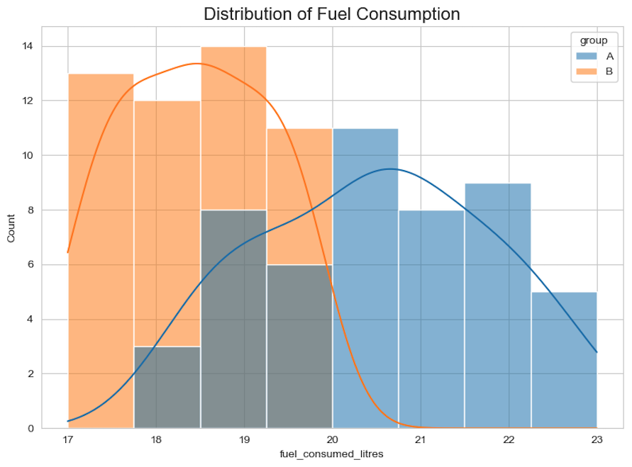
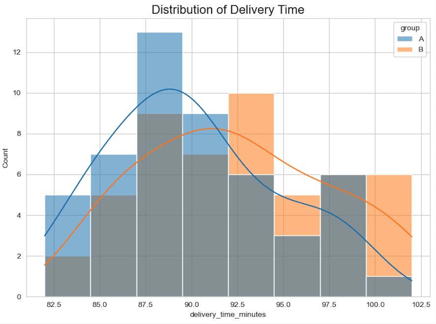

<h1>XYZ Logistics Inc. | Toronto Operations</h1>

Internal Memo: For Immediate Management Review

TO: Senior Logistics Management, Toronto

FROM: Kevin Yuan, Business & Data Analyst

SUBJECT: Final Recommendation on Eco-Algorithm Deployment

<h2>Executive Recommendation</h2>

I recommend we move forward with a <strong>strategic, hybrid deployment</strong> of the new eco-friendly routing algorithm. The A/B test has conclusively shown that the algorithm <strong>successfully reduces fuel consumption</strong> but at the cost of a <strong>statistically significant increase in delivery times.</strong> A full rollout is therefore inadvisable. Instead, a targeted approach will allow us to capture the cost savings while mitigating risk to our service-level agreements and customer satisfaction.

<h3 class="section-title">Analysis of Fuel Consumption (Primary Metric)</h3>
The primary goal was to reduce fuel costs. The test data confirms the new algorithm is highly effective. Group B (Eco-Algorithm) demonstrated a visibly lower average fuel consumption than the control group. A formal t-test yielded a p-value of 0.0000, confirming with high statistical confidence that these fuel savings are a real effect.

Figure 1: Group B shows a clear leftward shift, indicating a consistent reduction in fuel consumed per trip.

<h3 class="section-title">Analysis of Delivery Time (Guardrail Metric)</h3>
Our critical guardrail metric was delivery time. The data shows a small but consistent increase for Group B. While minor, a t-test confirmed this increase is a real and predictable side effect, with a p-value of 0.0197—below our 0.05 significance threshold.

Figure 2: Group B's distribution is shifted slightly right, indicating a statistically significant trend of longer delivery times.

<h3 class="section-title">Strategic Path Forward</h3>
The analysis presents a clear trade-off: cost savings vs. delivery speed. To harness the benefits while managing the drawbacks, I propose the following three-step action plan:

Quantify the Financial Trade-Off (Week of Sep 8): The immediate next step is to translate these findings into a clear financial model, offsetting the dollar value of fuel saved against the increased cost of driver wages and potential SLA penalties.

Initiate a Hybrid Deployment (Q4 2025): Based on the financial model, we will deploy the new algorithm selectively.

"Standard" Shipments: All non-urgent domestic deliveries will default to the new eco-algorithm to maximize fuel savings.

"Priority/Express" Shipments: All time-sensitive and cross-border shipments will continue to use the standard algorithm to guarantee delivery speed.

Monitor and Iterate: We will continuously monitor the performance of both algorithms and customer feedback in Q4 to refine this hybrid model, ensuring we are achieving the optimal balance of cost efficiency and service quality for our Toronto-based operations.

For a complete breakdown of the statistical methodology and Python code, please refer to the <a href="https://github.com/Kevin-yyuan/routing_algorithm_testing.git" target="_blank">full analysis in the project's Jupyter Notebook on GitHub</a>.

