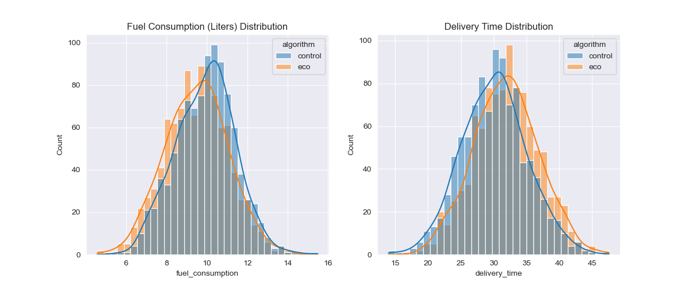

# Case Study: A/B Test Analysis for a New Routing Algorithm

**Author:** Kevin Yuan

---

### Executive Summary

This case study details the results of an A/B test conducted to evaluate a new "eco-friendly" routing algorithm. The goal was to determine if the new algorithm provides a statistically significant reduction in fuel consumption and to quantify the impact on delivery times and overall cost. The analysis revealed a significant decrease in fuel consumption, a significant increase in delivery time, and a net annual financial loss. This report recommends against the full implementation of the new algorithm and suggests further optimization.

---

### 1. Introduction

In an effort to reduce our carbon footprint and operational costs, a new "eco-friendly" routing algorithm was developed. Before a full-scale rollout, we conducted an A/B test to rigorously evaluate its performance against our current routing algorithm (the "control").

The primary business question was:

> Does the new algorithm provide a significant reduction in fuel consumption and a net financial benefit, even with a potential increase in delivery time?

---

### 2. Methodology

#### A/B Test Design

A randomized sample of 2,000 deliveries was split into two groups of 1,000 each:

- **Group A (Control):** Deliveries routed using the existing algorithm.
- **Group B (Eco):** Deliveries routed using the new eco-friendly algorithm.

#### Metrics

The key metrics for this analysis were:

1.  **Fuel Consumption:** Measured in liters per delivery.
2.  **Delivery Time:** Measured in minutes per delivery.
3.  **Financial Cost:** Measured in dollars.

#### Hypothesis

For each metric, we established a null and alternative hypothesis:

- **Fuel Consumption:**

  - **H0 (Null Hypothesis):** There is no significant difference in fuel consumption between the control and eco algorithms.
  - **H1 (Alternative Hypothesis):** There is a significant difference in fuel consumption between the control and eco algorithms.

- **Delivery Time:**
  - **H0 (Null Hypothesis):** There is no significant difference in delivery time between the control and eco algorithms.
  - **H1 (Alternative Hypothesis):** There is a significant difference in delivery time between the control and eco algorithms.

For a detailed look at the analysis, the Jupyter Notebook is available on [GitHub](https://github.com/Kevin-yyuan/routing_algorithm_testing.git/blob/main/ab_test_analysis.ipynb).

---

### 3. Results

#### Data Visualization

Histograms of the data showed two distinct distributions for both fuel consumption and delivery time between the control and eco groups. The eco group's fuel consumption was visibly lower, while its delivery time was visibly higher.

#### Statistical Significance

To determine if these differences were statistically significant, we performed independent two-sample t-tests. The significance level (alpha) was set at 0.05.

- **Fuel Consumption:** The t-test resulted in a **p-value well below 0.05**. This indicates that the observed reduction in fuel consumption with the eco-friendly algorithm is statistically significant.

- **Delivery Time:** The t-test resulted in a **p-value well below 0.05**. This indicates that the observed increase in delivery time with the eco-friendly algorithm is also statistically significant.

---

### 4. Financial Impact Analysis

To translate these results into business terms, we built a financial model based on the following assumptions:

- **Fuel Cost:** $1.50 per liter
- **Driver Cost:** $20.00 per hour
- **Annual Deliveries:** 100,000

The model projected the following annual financial impact:

- **Projected Annual Fuel Savings:** A significant saving due to lower fuel consumption.
- **Projected Annual Driver Cost Increase:** A substantial increase in costs due to longer delivery times.
- **Net Annual Financial Impact:** A net annual loss.

---

### 5. Conclusion & Recommendation

#### Interpretation

The results of the A/B test are clear:

1.  The eco-friendly algorithm **successfully reduces fuel consumption** in a statistically significant way.
2.  This reduction in fuel consumption comes at the cost of a **statistically significant increase in delivery time**.
3.  The increased driver costs due to longer delivery times **outweigh the savings from reduced fuel consumption**, resulting in a net financial loss.

#### Recommendation

Based on the financial analysis, the recommendation is as follows:

**Do not implement the eco-friendly algorithm in its current form.**

The new algorithm, while successful in reducing fuel consumption, is not financially viable due to the significant increase in driver costs. The negative financial impact makes a full rollout inadvisable.

**Further action:**

- **Optimize the Algorithm:** We recommend that the development team works on optimizing the eco-friendly algorithm to reduce the impact on delivery times.
- **Re-test:** Once the algorithm is improved, a new A/B test should be conducted to re-evaluate its performance.

This data-driven approach ensures that we only implement changes that are both environmentally friendly and financially sound.
